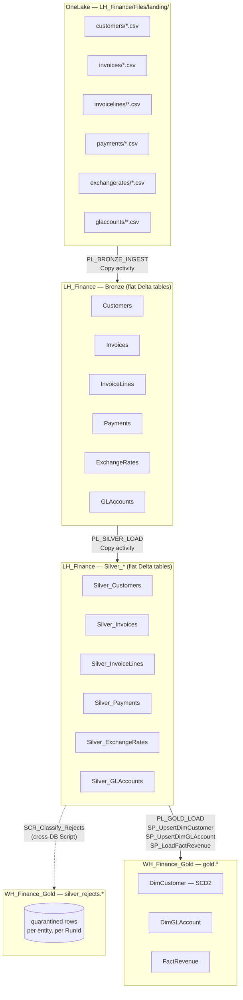

# Architecture

## Medallion flow

## Item inventory

| Item | Type | Purpose |
|---|---|---|
| `LH_Finance` | Lakehouse | Bronze + Silver Delta tables |
| `WH_Finance_Gold` | Warehouse | control / audit / silver_rejects / gold schemas |
| `PL_BRONZE_INGEST` | Data Pipeline | Copy landing CSVs → Bronze Delta table (self-configuring) |
| `PL_SILVER_LOAD` | Data Pipeline | Copy Bronze → Silver + classify/quarantine DQ rejects |
| `PL_GOLD_LOAD` | Data Pipeline | Upsert dims (SCD2) + load fact + run Gold validation |
| `PL_MASTER_ORCHESTRATOR` | Data Pipeline | Invokes the above 3, once per entity where applicable |

## Why Bronze/Silver in the Lakehouse, Gold in the Warehouse?

- Delta table writes (Copy activity `LakehouseTableSink`) are the natural Bronze/Silver
  destination for landing and lightly-conformed data — cheap, versioned, and directly queryable
  by Spark/notebooks later if needed.
- Gold's star schema, SCD2 dimension logic, and referential joins are much more naturally
  expressed in T-SQL against a Warehouse (which supports full DML: `UPDATE`, `MERGE`-style
  upserts, sequences) — the Lakehouse SQL analytics endpoint is **read-only**.
- Both share the same SQL analytics endpoint server per workspace, so a Warehouse-connected
  Script/Lookup activity can read Lakehouse tables directly via 3-part naming
  (`LH_Finance.dbo.Silver_Customers`) with no extra plumbing.

## Control-table-driven ("self-configuring") design

`control.SourceConfig` has one row per entity with: `SourcePath`, `BronzeTable`, `SilverTable`,
`LoadMode`, `TolerancePct`, `RejectPredicate`, `RejectColumns`. Both `PL_BRONZE_INGEST` and
`PL_SILVER_LOAD` take **only `p_entity_name`** (plus run-control parameters `p_run_id`,
`p_parent_run_id`, `p_run_date`, `p_load_type`) and look everything else up via a `LKP_Config`
Lookup activity at the start of the pipeline. This means:

- Adding a 7th entity = one new row in `control.SourceConfig`. No pipeline edits.
- `PL_MASTER_ORCHESTRATOR`'s `ExecutePipeline` blocks are short and uniform — just the entity name
  and run-id wiring differ per block.
