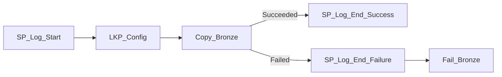

# PL_BRONZE_INGEST — Build Guide

**Purpose**: copy landing CSV(s) for one entity into the Lakehouse Bronze Delta table, self-
configuring via `control.SourceConfig`, with audit logging and failure handling.

## Parameters

| Name | Default | Notes |
|---|---|---|
| `p_entity_name` | `Customers` | The only real business input — must match a row in `control.SourceConfig.EntityName` |
| `p_load_type` | `Full` | `Full` or `Incremental` (informational — passed through to audit log) |
| `p_run_id` | `""` | Unique ID for this run (used in audit log) |
| `p_parent_run_id` | `""` | Set by the master orchestrator to `pipeline().RunId` |
| `p_run_date` | today's date | Logical business date for the audit log |

## Activity graph



## Steps

### 1. `SP_Log_Start` (Stored Procedure)
Calls `audit.SP_LogPipelineStart` with `PipelineName='PL_BRONZE_INGEST'`, using
`p_run_id`/`p_parent_run_id`/`p_entity_name`/`p_run_date`/`p_load_type`.

### 2. `LKP_Config` (Lookup)
Connection: `WH_Finance_Gold`. Query (built dynamically with `@concat`):
```sql
SELECT LEFT(REPLACE(SourcePath,'Files/',''), LEN(REPLACE(SourcePath,'Files/','')) - 1) AS SourceFolder,
       BronzeTable, LoadMode
FROM control.SourceConfig
WHERE EntityName = '<p_entity_name>'
```
`First row only`: true. This resolves the landing folder (relative to `Files/`, no trailing
slash), the target Bronze table name, and the load mode — all from one metadata row.

### 3. `Copy_Bronze` (Copy activity) — the key step

**Source** (Lakehouse Files, delimited text):
- `storeSettings.type = LakehouseReadSettings`, `recursive = true`
- `wildcardFolderPath = @activity('LKP_Config').output.firstRow.SourceFolder`
- `wildcardFileName = *.csv`
- dataset `location.folderPath = ""` (empty — `Files/` is implicit; see
  [lessons-learned.md](../06-monitoring/lessons-learned.md) #2 for why this matters)

**Sink** (Lakehouse Table — Delta):
- `table = @activity('LKP_Config').output.firstRow.BronzeTable`
- `tableActionOption = @if(equals(activity('LKP_Config').output.firstRow.LoadMode,'Full'),'Overwrite','Append')`

### 4. `SP_Log_End_Success` / `SP_Log_End_Failure` (Stored Procedure)
On success: `audit.SP_LogPipelineEnd @Status='Succeeded'`.
On failure (dependsOn `Copy_Bronze` **Failed**): same proc with `@Status='Failed'` and
`@ErrorMessage = @string(activity('Copy_Bronze').Error.message)`.

### 5. `Fail_Bronze` (Fail activity)
DependsOn `SP_Log_End_Failure` **Succeeded** — ensures the error is logged *before* the pipeline
run is marked failed, and re-raises so the caller (master orchestrator) sees the failure.

## Verified results (this build)

| Entity | Bronze rows |
|---|---|
| Customers | 124 |
| Invoices | 1020 |
| InvoiceLines | 2973 |
| Payments | 831 |
| ExchangeRates | 2069 |
| GLAccounts | 21 |

Exact match to source CSV row counts — confirms the Copy activity moved every row correctly.
