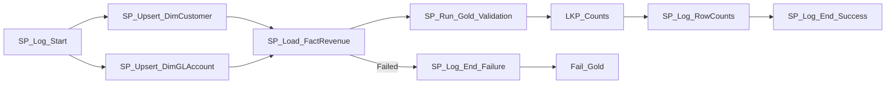

# PL_GOLD_LOAD — Build Guide

**Purpose**: upsert Gold dimensions (SCD2 for customers), load the revenue fact, and run Gold-level
data-quality validation.

## Parameters

| Name | Default | Notes |
|---|---|---|
| `p_load_type` | `Full` | Passed to `gold.SP_LoadFactRevenue` — `Full` truncates+reloads the fact |
| `p_run_id` | `""` | Used as `LoadRunId` on every fact row and in `audit.ValidationLog` |
| `p_parent_run_id` | `""` | Set by the master orchestrator |
| `p_run_date` | today's date | |

No `p_entity_name` — this pipeline always processes all 6 Silver entities at once (Gold is a
cross-entity star schema, not a per-entity load).

## Activity graph

## Steps

### 1. `SP_Log_Start` — `PipelineName='PL_GOLD_LOAD'`, `EntityName='ALL'`.

### 2/3. `SP_Upsert_DimCustomer` / `SP_Upsert_DimGLAccount` (Stored Procedures, run in parallel)
Pass `PipelineRunId=<p_run_id>` to both procedures. They read all of
`LH_Finance.dbo.Silver_Customers` / `LH_Finance.dbo.Silver_GLAccounts` directly and write their
own `audit.ActivityRun` row with exact `RowsInserted` and `RowsUpdated` values.

- `gold.SP_UpsertDimCustomer` — **SCD2**: closes out (`IsCurrent=0`, sets `ValidToUtc`) any
  existing current row whose attributes changed (hash comparison), then inserts new/changed rows
  as the new current version. Defensively filters `CustomerName IS NOT NULL AND LEN(Country)=2`
  and **dedups** on `CustomerID` (`ROW_NUMBER() OVER (PARTITION BY CustomerID ...)`) because Silver
  still contains genuine duplicate customer rows (an injected DQ issue) — without the dedup, a
  single `INSERT...SELECT` statement can insert two "current" rows for the same customer in one
  statement (the `NOT EXISTS` check only sees the table's state *before* the statement runs).
- `gold.SP_UpsertDimGLAccount` — simple full-refresh (`DELETE` + re-`INSERT`), no SCD needed for
  reference data.

### 4. `SP_Load_FactRevenue` (Stored Procedure)
`gold.SP_LoadFactRevenue @LoadRunId=<p_run_id>, @LoadType=<p_load_type>`. Joins
`Silver_InvoiceLines` + `Silver_Invoices` + `Silver_ExchangeRates` (LEFT JOIN, defaults to rate
`1.0` if no match), then inner-joins to `gold.DimCustomer`/`gold.DimGLAccount` (which naturally
excludes orphaned customers/accounts). Filters `InvoiceDate IS NOT NULL AND Quantity > 0 AND
UnitPrice IS NOT NULL`.

The procedure writes its own `audit.ActivityRun` row with `RowsInserted`. The pipeline therefore
depends directly on these three business procedures; separate post-procedure audit wrapper
activities are intentionally not used because concurrent replacement of the same audit row can
cause Fabric Warehouse snapshot-isolation conflicts.

### 5. `SP_Run_Gold_Validation` → `audit.SP_RunGoldValidation @PipelineRunId=<p_run_id>`
Three rules, each writing a Pass/Fail row to `audit.ValidationLog`:
1. No null dimension keys in the fact table.
2. **No duplicate invoice lines** (`GROUP BY LineID HAVING COUNT(*) > 1`).
3. Revenue amounts non-negative.

> In this build, rule #2 genuinely **fails** (55 duplicate lines) because the source data has 20
> deliberately-duplicated `InvoiceID`s that the Silver DQ rule for Invoices doesn't check for
> (it only checks date validity and orphan customers). **This is left as-is** — it's a real
> validation catch, exactly what the demo is supposed to show. Don't "fix" it by suppressing the
> rule; if you want zero failures, add a duplicate-InvoiceID check to
> `control.SourceConfig.RejectPredicate` for the `Invoices` row instead.

### 6/7. `LKP_Counts` + `SP_Log_RowCounts` — same row-count-logging pattern as Silver
(`SourceCnt` = `Silver_InvoiceLines` row count, `TargetCnt` = `gold.FactRevenue` rows for this
`LoadRunId`).

### 8. `SP_Log_End_Success` / `SP_Log_End_Failure` + `Fail_Gold`.

## Verified results (this build)

`gold.DimCustomer`: 118 current rows · `gold.DimGLAccount`: 21 rows · `gold.FactRevenue`: ~2,550–
2,689 rows (varies slightly run-to-run due to duplicate-InvoiceID pairing in source data) · ~$53M
total `LineAmountUSD`.
