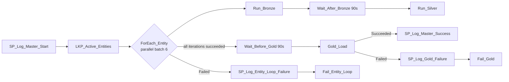

# PL_MASTER_ORCHESTRATOR - Metadata-Driven Build Guide

**Purpose**: read active entities from `control.SourceConfig`, run Bronze then Silver for each entity,
and run Gold only after every Silver load succeeds.

For complete portal creation steps, start with [portal-build-guide.md](portal-build-guide.md).

## Parameters

| Name | Default | Notes |
|---|---|---|
| `p_load_type` | `Full` | Passed to every child pipeline |
| `p_run_date` | current date | Passed to every child pipeline |

## Activity graph



The ForEach does not finish until every iteration finishes. `Wait_Before_Gold` depends on
`ForEach_Entity` with the **Succeeded** condition, so Gold cannot run while any Silver load is still
running and does not run if any Bronze or Silver child fails.

## Top-level activities

| Order | Activity | Type | Depends on |
|---|---|---|---|
| 1 | `SP_Log_Master_Start` | Stored procedure | none |
| 2 | `LKP_Active_Entities` | Lookup | master start succeeded |
| 3 | `ForEach_Entity` | ForEach | Lookup succeeded |
| 4 | `Wait_Before_Gold` | Wait, 90 seconds | ForEach succeeded |
| 5 | `Gold_Load` | Execute Pipeline | wait succeeded |
| 6 | `SP_Log_Master_Success` | Stored procedure | Gold succeeded |
| 7 | `SP_Log_Entity_Loop_Failure` | Stored procedure | ForEach failed |
| 8 | `Fail_Entity_Loop` | Fail | loop failure logged |
| 9 | `SP_Log_Gold_Failure` | Stored procedure | Gold failed |
| 10 | `Fail_Gold` | Fail | Gold failure logged |

## Active-entity Lookup

Connection: `WH_Finance_Gold`. Set **First row only** to false.

```sql
SELECT EntityName
FROM control.SourceConfig
WHERE IsActive = 1
ORDER BY EntityName;
```

## ForEach configuration

| Setting | Value |
|---|---|
| Items | `@activity('LKP_Active_Entities').output.value` |
| Sequential | false |
| Batch count | 6 |

Inside the loop:

```text
Run_Bronze -> Wait_After_Bronze (90 seconds) -> Run_Silver
```

Both Execute Pipeline activities use **Wait on completion**.

### Run_Bronze parameters

| Parameter | Expression |
|---|---|
| `p_entity_name` | `@item().EntityName` |
| `p_load_type` | `@pipeline().parameters.p_load_type` |
| `p_run_id` | `@concat(substring(pipeline().RunId, 0, 36), '-b-', substring(item().EntityName, 0, 8))` |
| `p_parent_run_id` | `@pipeline().RunId` |
| `p_run_date` | `@pipeline().parameters.p_run_date` |

### Run_Silver parameters

Use the same mappings, with this run ID:

```text
@concat(substring(pipeline().RunId, 0, 36), '-s-', substring(item().EntityName, 0, 8))
```

The child run IDs are at most 47 characters and fit `audit.PipelineRunLog.PipelineRunId VARCHAR(50)`.

## Gold configuration

`Gold_Load` calls `PL_GOLD_LOAD` after `Wait_Before_Gold` succeeds.

| Parameter | Expression |
|---|---|
| `p_load_type` | `@pipeline().parameters.p_load_type` |
| `p_run_id` | `@concat(pipeline().RunId, '-gl')` |
| `p_parent_run_id` | `@pipeline().RunId` |
| `p_run_date` | `@pipeline().parameters.p_run_date` |

## Why this design

- Adding an entity requires a row in `control.SourceConfig`, not three new master activities.
- `IsActive` controls whether the entity participates in a run.
- Parallel ForEach iterations preserve throughput.
- Bronze, wait, and Silver stay ordered within each entity.
- Gold has one clear barrier: successful completion of the entire entity loop.
- The canvas remains readable as the number of entities grows.

## Expected run shape

For six active entities, Monitoring hub shows one master Lookup and six ForEach iterations. Each
iteration invokes one Bronze and one Silver child. Gold is invoked once after all six iterations.

| Pipeline | Expected child runs |
|---|---:|
| `PL_BRONZE_INGEST` | 6 |
| `PL_SILVER_LOAD` | 6 |
| `PL_GOLD_LOAD` | 1 |

To add a seventh entity, insert its configuration row, upload its landing file, and set
`IsActive = 1`. The master definition does not change.
