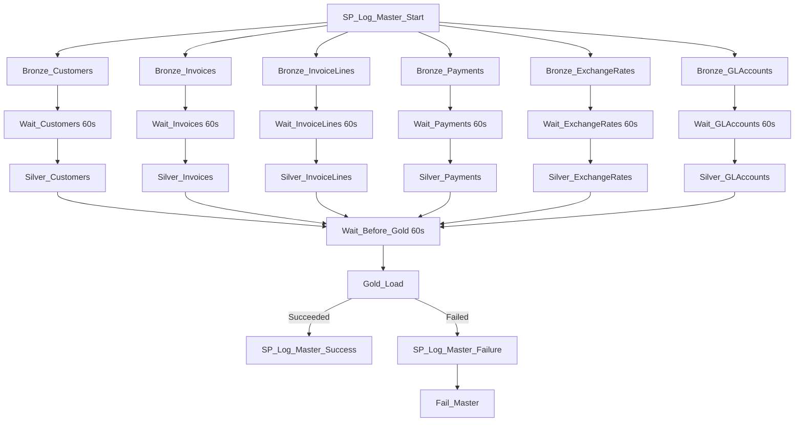

# PL_MASTER_ORCHESTRATOR — Build Guide

**Purpose**: run the whole medallion flow — Bronze (×6 entities, parallel) → Silver (×6 entities,
each gated on its own Bronze) → Gold (once, gated on all 6 Silver) — with a shared `RunId` for
end-to-end audit correlation.

## Parameters

| Name | Default | Notes |
|---|---|---|
| `p_load_type` | `Full` | Passed through to every child pipeline |
| `p_run_date` | today's date | Passed through to every child pipeline |

## Activity graph

## Design notes

- **Each child call passes only `p_entity_name` + run controls** (`p_load_type`, `p_run_id`,
  `p_parent_run_id`, `p_run_date`) — the child pipelines self-configure the rest via
  `LKP_Config` against `control.SourceConfig`. See
  [lessons-learned.md](../06-monitoring/lessons-learned.md) #8.
- **`p_run_id` per child uses a short suffix**, e.g. `@concat(pipeline().RunId, '-bc')` for
  `Bronze_Customers`. Don't use long descriptive prefixes like `'bronze-customers-'` +
  `pipeline().RunId` — that exceeds `VARCHAR(50)` on `audit.PipelineRunLog.PipelineRunId` and
  `silver_rejects.<Entity>.RunId`, and Fabric Warehouse doesn't support widening the column via
  `ALTER COLUMN` (see [lessons-learned.md](../06-monitoring/lessons-learned.md) #4).
- **`p_parent_run_id` for every child is `@pipeline().RunId`** (the master's own run ID) — this is
  what lets you correlate every Bronze/Silver/Gold audit row back to a single orchestration run.
- **`Wait_<Entity>` (60s) between each `Bronze_<Entity>` and `Silver_<Entity>`**, and
  **`Wait_Before_Gold` (60s) after all Silver activities**, buffer the Lakehouse SQL analytics
  endpoint metadata sync lag (see [lessons-learned.md](../06-monitoring/lessons-learned.md) #3).
  `PL_SILVER_LOAD` has its own internal wait too (between its Copy and its Script activity) — so
  there are effectively two sync buffers per entity: one before Silver starts, one inside Silver
  before it reads back what it just wrote.
- **Bronze/Silver activities for different entities run in parallel** (each only depends on its
  own predecessor) — the whole run typically completes in 10–15 minutes, dominated by the
  `Wait` buffers, not actual data movement (which is a few seconds per entity at this data volume).

## Verified end-to-end result (audit.PipelineRunLog for one master RunId)

| PipelineName | EntityName | Status | Source | Target | Rejected |
|---|---|---|---|---|---|
| PL_MASTER_ORCHESTRATOR | ALL | Succeeded | – | – | – |
| PL_BRONZE_INGEST | Customers/Invoices/InvoiceLines/Payments/ExchangeRates/GLAccounts (×6) | Succeeded | – | – | – |
| PL_SILVER_LOAD | (×6, same entities) | Succeeded | matches Bronze | matches Bronze | 5/70/250/51/41/3 |
| PL_GOLD_LOAD | ALL | Succeeded | 2973 | ~2550–2689 | 0 |

## Simulating a failure (for the demo)

Easiest reproducible failure: temporarily rename or delete one of the landing CSVs in OneLake
before running, or pass a `p_entity_name` that doesn't exist in `control.SourceConfig` when
running `PL_BRONZE_INGEST` standalone — `LKP_Config`'s `firstRowOnly` Lookup will return no rows,
and the subsequent `Copy_Bronze` activity's dynamic content expressions will fail to resolve,
triggering `SP_Log_End_Failure` → `Fail_Bronze`, which is then visible as a `Failed` status on
whichever `Bronze_<Entity>` `ExecutePipeline` activity called it, and logged with a full error
message in `audit.PipelineRunLog`.
