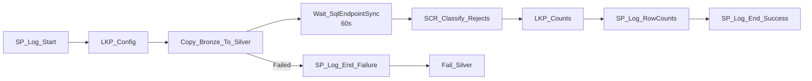

# PL_SILVER_LOAD — Build Guide

**Purpose**: copy Bronze → Silver Delta table, classify + quarantine DQ-violating rows into a
Warehouse reject table, and log row-count reconciliation — all self-configured from
`control.SourceConfig`.

> **Why Copy + Script instead of Dataflow Gen2?** A real Dataflow Gen2 (Power Query) implementation
> is the more "native" way to express per-entity DQ rules, but authoring one via the REST API
> requires resolving a gateway `ClusterId`, binding a Connection, and building a two-query
> `DataDestinations` M pattern — several extra moving parts for a PoC. This Copy+Script pattern
> is fully real (genuine Copy activity + genuine T-SQL DQ classification, not a stub), verified
> end-to-end, and much faster to stand up. If you want to swap in a real Dataflow Gen2 later, the
> `control.SourceConfig.RejectPredicate` values in this repo translate directly into Power Query
> `if`/`then` custom-column expressions.

## Parameters

Same five as `PL_BRONZE_INGEST`: `p_entity_name`, `p_load_type`, `p_run_id`, `p_parent_run_id`,
`p_run_date`.

## Activity graph



## Steps

### 1. `SP_Log_Start` — same pattern as Bronze.

### 2. `LKP_Config` (Lookup on `WH_Finance_Gold`)
```sql
SELECT BronzeTable, SilverTable, RejectPredicate, RejectColumns
FROM control.SourceConfig
WHERE EntityName = '<p_entity_name>'
```

### 3. `Copy_Bronze_To_Silver` (Copy activity)
Source: `LakehouseTableSource`, table = `@activity('LKP_Config').output.firstRow.BronzeTable`.
Sink: `LakehouseTableSink`, table = `@activity('LKP_Config').output.firstRow.SilverTable`,
`tableActionOption = Overwrite`.

> This copies **all** Bronze rows into Silver, including DQ-violating ones — the Lakehouse SQL
> endpoint is read-only, so a later step can't `DELETE` bad rows out of Silver. See
> [lessons-learned.md](../06-monitoring/lessons-learned.md) #7.

### 4. `Wait_SqlEndpointSync` (Wait, 60s)
Buffers the SQL analytics endpoint metadata sync lag before the next step queries the freshly
overwritten Silver table. See [lessons-learned.md](../06-monitoring/lessons-learned.md) #3.

### 5. `SCR_Classify_Rejects` (Script on `WH_Finance_Gold`)
Dynamically-built INSERT, reading Bronze via cross-database 3-part naming:
```sql
INSERT INTO silver_rejects.<Entity> (RunId, RejectedAtUtc, RuleCode, <RejectColumns>, RawRow)
SELECT '<p_run_id>', SYSUTCDATETIME(), 'DQ_REJECT', <RejectColumns>,
       CONCAT_WS('|', <RejectColumns>)
FROM LH_Finance.dbo.<BronzeTable>
WHERE <RejectPredicate>;
```
`RejectColumns` and `RejectPredicate` both come from `LKP_Config` — this one Script activity works
for all 6 entities without any per-entity branching in the pipeline itself.

### 6. `LKP_Counts` (Lookup)
```sql
SELECT (SELECT COUNT(*) FROM LH_Finance.dbo.<BronzeTable>) AS SourceCnt,
       (SELECT COUNT(*) FROM LH_Finance.dbo.<SilverTable>) AS TargetCnt,
       (SELECT COUNT(*) FROM silver_rejects.<Entity> WHERE RunId='<p_run_id>') AS RejectedCnt;
```
> **Gotcha**: in the Lookup activity's `typeProperties`, `datasetSettings` must be a **sibling** of
> `source`, not nested inside it — see [lessons-learned.md](../06-monitoring/lessons-learned.md) #5.

### 7. `SP_Log_RowCounts` → `audit.SP_LogRowCounts` with the 3 counts from step 6.

### 8. `SP_Log_End_Success` / `SP_Log_End_Failure` + `Fail_Silver` — same pattern as Bronze.

## Verified results (this build)

| Entity | Source | Target | Rejected |
|---|---|---|---|
| Customers | 124 | 124 | 5 |
| Invoices | 1020 | 1020 | 70 |
| InvoiceLines | 2973 | 2973 | 250 |
| Payments | 831 | 831 | 51 |
| ExchangeRates | 2069 | 2069 | 41 |
| GLAccounts | 21 | 21 | 3 |
