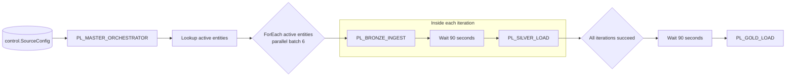
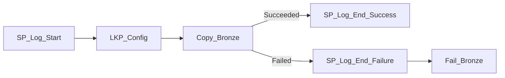
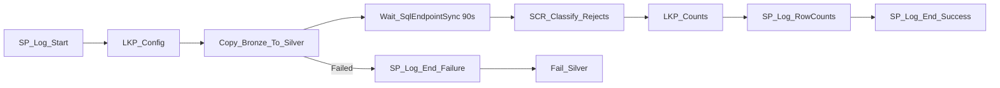
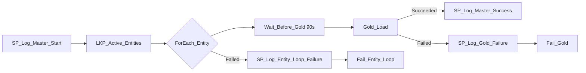

# Fabric Pipelines - Portal-First Build Guide

This is the recommended build sequence for the Finance PoC. Build the pipelines in the Fabric
portal; the JSON exports and PowerShell scripts are optional deployment shortcuts.

## Reference architecture



Inside each ForEach iteration, Bronze, Wait, and Silver are sequential. Different entities run in
parallel. Gold starts only after the complete ForEach activity succeeds, which means every active
entity's Silver load has completed successfully.

## Build order

1. Create `LH_Finance` and `WH_Finance_Gold`.
2. Run the SQL scripts in [03-sql](../03-sql/) in numeric order.
3. Upload the six CSV files by following
   [manual-upload-to-lakehouse.md](../02-data/manual-upload-to-lakehouse.md).
4. Build and test `PL_BRONZE_INGEST` for `Customers`.
5. Build and test `PL_SILVER_LOAD` for `Customers`.
6. Build and test `PL_GOLD_LOAD` after all six Silver tables exist.
7. Build `PL_MASTER_ORCHESTRATOR` last because it references the three child pipelines.
8. Run the master and verify the audit tables.

## Create a pipeline item

For each pipeline:

1. Open workspace `WS_Finance_POC`.
2. Select **New item** > **Data pipeline**.
3. Enter the exact pipeline name from this guide.
4. Use the pipeline canvas to add activities.
5. Rename every activity immediately after adding it; expressions and dependencies use these names.
6. Open the pipeline background or **Parameters** area to add the parameters before configuring
   activity expressions.
7. Save after each activity is configured.

## 1. Build PL_BRONZE_INGEST

Create the five string parameters listed in [pl_bronze_ingest.md](pl_bronze_ingest.md#parameters),
then create the activities in this order:



Use [pl_bronze_ingest.md](pl_bronze_ingest.md) for the stored-procedure mappings, Lookup query,
and Copy source/sink settings. The critical Copy settings are:

- Source connection: `LH_Finance`.
- Source format: delimited text with first row as header.
- Source folder path: empty.
- Wildcard folder: `@activity('LKP_Config').output.firstRow.SourceFolder`.
- Wildcard filename: `*.csv`.
- Sink connection: `LH_Finance`.
- Sink table: `@activity('LKP_Config').output.firstRow.BronzeTable`.

Test with:

| Parameter | Value |
|---|---|
| `p_entity_name` | `Customers` |
| `p_load_type` | `Full` |
| `p_run_id` | `bronze-test-customers` |
| `p_parent_run_id` | empty |
| `p_run_date` | current date |

Confirm `LH_Finance.Tables.Customers` contains 124 rows before proceeding.

## 2. Build PL_SILVER_LOAD

Create the same five string parameters as Bronze, then create:



Use [pl_silver_load.md](pl_silver_load.md) for the dynamic Lookup and Script expressions. Configure
`Wait_SqlEndpointSync` for **90 seconds**. Test `Customers` with run ID
`silver-test-customers`; confirm `Silver_Customers` has 124 rows and the Customers reject table has
rows for that run.

Run Bronze and Silver once for all six entities before testing Gold. You can run each child
manually with these entity names:

`Customers`, `Invoices`, `InvoiceLines`, `Payments`, `ExchangeRates`, `GLAccounts`.

## 3. Build PL_GOLD_LOAD

Create the four string parameters in [pl_gold_load.md](pl_gold_load.md#parameters); Gold has no
`p_entity_name`. Build the activity graph in that guide. The two dimension stored procedures run in
parallel, and `SP_Load_FactRevenue` depends on both succeeding.

Test with:

| Parameter | Value |
|---|---|
| `p_load_type` | `Full` |
| `p_run_id` | `gold-test` |
| `p_parent_run_id` | empty |
| `p_run_date` | current date |

Verify `gold.DimCustomer`, `gold.DimGLAccount`, `gold.FactRevenue`, and `audit.ValidationLog`.

## 4. Build PL_MASTER_ORCHESTRATOR

Create two string parameters:

| Name | Default |
|---|---|
| `p_load_type` | `Full` |
| `p_run_date` | current date in `yyyy-MM-dd` format |

Build this graph:



### Configure LKP_Active_Entities

1. Add a **Lookup** activity and connect it after `SP_Log_Master_Start` on **Succeeded**.
2. Select the `WH_Finance_Gold` Warehouse connection.
3. Choose query mode and enter:

```sql
SELECT EntityName
FROM control.SourceConfig
WHERE IsActive = 1
ORDER BY EntityName;
```

4. Clear **First row only**. The ForEach requires the complete `output.value` array.

### Configure ForEach_Entity

1. Add a **ForEach** activity after the Lookup on **Succeeded**.
2. Set **Items** to:

```text
@activity('LKP_Active_Entities').output.value
```

3. Turn **Sequential** off.
4. Set **Batch count** to `6`.
5. Open the ForEach edit canvas and add these three activities in order:
   `Run_Bronze` > `Wait_After_Bronze` > `Run_Silver`.
6. Set `Wait_After_Bronze` to `90` seconds.

Configure both Execute Pipeline activities with **Wait on completion** enabled.

`Run_Bronze` calls `PL_BRONZE_INGEST`:

| Child parameter | Value |
|---|---|
| `p_entity_name` | `@item().EntityName` |
| `p_load_type` | `@pipeline().parameters.p_load_type` |
| `p_run_id` | `@concat(substring(pipeline().RunId, 0, 36), '-b-', substring(item().EntityName, 0, 8))` |
| `p_parent_run_id` | `@pipeline().RunId` |
| `p_run_date` | `@pipeline().parameters.p_run_date` |

`Run_Silver` calls `PL_SILVER_LOAD` with the same mappings except:

```text
p_run_id = @concat(substring(pipeline().RunId, 0, 36), '-s-', substring(item().EntityName, 0, 8))
```

### Gate Gold after Silver

1. Add `Wait_Before_Gold` after `ForEach_Entity` on **Succeeded** and set it to 90 seconds.
2. Add `Gold_Load` after the wait on **Succeeded**.
3. Select child pipeline `PL_GOLD_LOAD` and enable **Wait on completion**.
4. Map its parameters:

| Child parameter | Value |
|---|---|
| `p_load_type` | `@pipeline().parameters.p_load_type` |
| `p_run_id` | `@concat(pipeline().RunId, '-gl')` |
| `p_parent_run_id` | `@pipeline().RunId` |
| `p_run_date` | `@pipeline().parameters.p_run_date` |

An activity after a ForEach starts only after all iterations finish. Because the dependency is
**Succeeded**, any failed Bronze or Silver child prevents Gold from running.

Use [pl_master_orchestrator.md](pl_master_orchestrator.md) for master audit and failure mappings.

## Run and verify

Run `PL_MASTER_ORCHESTRATOR` with `Full` and the current business date. In Monitoring hub, expect:

1. One active-entity Lookup.
2. Six ForEach iterations, with Bronze then Silver in each.
3. Gold only after all six Silver calls complete.
4. A completed master audit row.

Verify in the Warehouse:

```sql
SELECT PipelineRunId, ParentRunId, PipelineName, EntityName, Status,
       SourceRowCount, TargetRowCount, RejectedRowCount, ErrorMessage
FROM audit.PipelineRunLog
ORDER BY LoggedAt DESC;
```

## Optional JSON and PowerShell deployment

The portal build is the primary learning path. For repeatable redeployment, the matching definitions
are in [exports](exports/), with these optional scripts:

- `deploy-pipeline.ps1` creates a pipeline item.
- `update-pipeline.ps1` updates an existing pipeline item.
- `run-pipeline.ps1` triggers a run.

Replace workspace, Lakehouse, Warehouse, endpoint, and child pipeline IDs in the exports before
using them in another workspace.
