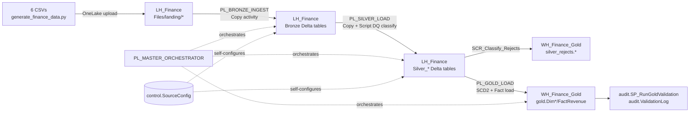

# Microsoft Fabric Finance PoC — Pipeline Orchestration & Operational Excellence (Practice Edition)

> **Audience**: anyone who watched the live demo and wants to rebuild it themselves to practice.
> **Focus**: Fabric Data Factory pipeline orchestration, parameterization, self-configuring
> (metadata-driven) design, audit logging, data-quality quarantine, row-count reconciliation,
> and Gold star-schema loading — built and verified end-to-end against a real Fabric workspace.
> **Not the focus**: fancy transformation logic (kept intentionally simple and inspectable).

This repo is a **verified, working rebuild** of a Bronze → Silver → Gold medallion pipeline for a
6-entity Finance / Accounts-Receivable dataset. Every SQL script, pipeline JSON export, and step in
[07-demo-script/demo-runbook.md](07-demo-script/demo-runbook.md) was actually deployed and run
against a live Fabric workspace before being committed here — including the bugs we hit and fixed
along the way (see [06-monitoring/lessons-learned.md](06-monitoring/lessons-learned.md)).

## Business scenario

Finance / Accounts Receivable for a mid-size manufacturer. Six related CSV source tables, each with
deliberately injected data-quality problems, so the demo can show ingestion, cleansing, quarantine,
reconciliation, and Gold reporting.

| # | Entity | Grain | Injected DQ issues |
|---|--------|-------|---------------------|
| 1 | Customers | 1 row / customer | nulls, duplicates, bad country codes |
| 2 | Invoices | 1 row / invoice header | duplicate IDs, null/future dates, orphan customers |
| 3 | InvoiceLines | 1 row / invoice line | negative qty, null price, orphan invoices |
| 4 | Payments | 1 row / payment | null method, bad dates |
| 5 | ExchangeRates | 1 row / currency / day | missing/zero rates |
| 6 | GLAccounts | 1 row / GL account | inactive accounts, null names |

## Folder layout

```
practice-repo/
├── README.md                          ← you are here
├── 01-architecture/
│   └── architecture.md                ← medallion + component diagrams (Mermaid)
├── 02-data/
│   ├── generate_finance_data.py        ← generates all 6 source CSVs with DQ issues (stdlib only)
│   └── upload_to_onelake.ps1           ← lands the CSVs in LH_Finance/Files/landing/<entity>/
├── 03-sql/
│   ├── 01_audit_framework.sql          ← audit schema, run-log, validation-log, logging procs
│   ├── 02_control_and_rejects.sql      ← control.SourceConfig (metadata-driven config) + silver_rejects.*
│   ├── 03_gold_warehouse_schema.sql    ← Gold star schema (dims + fact) + load procs
│   └── 04_validation_framework.sql     ← reconciliation + Gold validation rules
├── 04-pipelines/
│   ├── pl_bronze_ingest.md             ← build guide
│   ├── pl_silver_load.md               ← build guide
│   ├── pl_gold_load.md                 ← build guide
│   ├── pl_master_orchestrator.md       ← build guide
│   ├── deploy-pipeline.ps1             ← generic "create DataPipeline item" script
│   ├── update-pipeline.ps1             ← generic "update pipeline definition" script
│   ├── run-pipeline.ps1                ← generic "trigger a pipeline run" script
│   └── exports/                        ← the exact, working pipeline-content.json for all 4 pipelines
├── 06-monitoring/
│   ├── monitoring-guide.md             ← Monitoring hub, audit SQL, reconciliation, alerts
│   └── lessons-learned.md              ← every real bug we hit + the fix (read this before you start!)
└── 07-demo-script/
    └── demo-runbook.md                 ← step-by-step rebuild + live-demo runbook
```

## Architecture at a glance



**Key design decision: Bronze and Silver live in the Lakehouse (`LH_Finance`) as flat Delta tables**
(no schema-enablement), while **Gold, audit, and control metadata live in the Warehouse**
(`WH_Finance_Gold`). Both share the same SQL analytics endpoint server per workspace, so cross-database
T-SQL queries like `SELECT * FROM LH_Finance.dbo.Silver_Customers` work directly from a Warehouse
connection — no shortcuts or mirroring needed.

**Self-configuring pipelines.** `PL_BRONZE_INGEST` and `PL_SILVER_LOAD` each take only
`p_entity_name` (+ run-control parameters) as real input. A `LKP_Config` Lookup activity reads
everything else — source path, table names, load mode, DQ reject rule — from
`control.SourceConfig` at runtime. Add a 7th entity by inserting one row into that table; no
pipeline changes needed.

## Prerequisites

- A Fabric workspace with capacity (F2 minimum).
- `az` CLI logged in (`az login`) with access to the Fabric REST API.
- `sqlcmd` (Go version) for running the SQL scripts: `winget install sqlcmd`.
- Python 3.10+ for the data generator (standard library only, no pip installs needed).
- PowerShell 7+ (pwsh) for the deploy/run scripts.

## Rebuild steps

1. **Create the workspace + items** — one Workspace, one Lakehouse (`LH_Finance`), one Warehouse
   (`WH_Finance_Gold`). See [07-demo-script/demo-runbook.md § Step 1](07-demo-script/demo-runbook.md).
2. **Deploy the SQL** — run the 4 scripts in [03-sql/](03-sql/) in order against `WH_Finance_Gold`
   via `sqlcmd`.
3. **Generate + land the data** — run [generate_finance_data.py](02-data/generate_finance_data.py),
   then [upload_to_onelake.ps1](02-data/upload_to_onelake.ps1) (edit the workspace/lakehouse IDs at
   the top first).
4. **Deploy the 4 pipelines** — use [deploy-pipeline.ps1](04-pipelines/deploy-pipeline.ps1) against
   each JSON in [04-pipelines/exports/](04-pipelines/exports/) (edit the `workspaceId`/`artifactId`
   GUIDs inside each JSON to match your workspace first — see the build guides for exactly which
   lines to change).
5. **Run it** — trigger `PL_MASTER_ORCHESTRATOR` via [run-pipeline.ps1](04-pipelines/run-pipeline.ps1)
   with `{"p_load_type":"Full","p_run_date":"<today>"}`.
6. **Verify** — query `audit.PipelineRunLog` and `audit.ValidationLog` in `WH_Finance_Gold`.
7. **Monitor it** — follow [06-monitoring/monitoring-guide.md](06-monitoring/monitoring-guide.md)
  for Monitoring hub, audit queries, reconciliation, troubleshooting, and alerting options.

**Read [06-monitoring/lessons-learned.md](06-monitoring/lessons-learned.md) before you start** — it
documents every real error we hit (SQL-endpoint metadata sync lag, trigger-parameter serialization,
Copy-activity path gotchas, Fabric-DW `ALTER COLUMN` limitations) and the exact fix, so you don't
have to rediscover them.

## What you'll see when it works

- **Source data arrival**: 6 CSVs landing in OneLake `Files/landing/<entity>/`.
- **Pipeline execution + parameter usage**: one `PL_BRONZE_INGEST` / `PL_SILVER_LOAD` pipeline
  definition, invoked 6× each with different `p_entity_name` values.
- **Self-configuring Lookup**: `LKP_Config` resolving all per-entity settings from
  `control.SourceConfig` — no hardcoded folder/table names in the pipeline.
- **Audit table updates**: every run logged to `audit.PipelineRunLog` (start/success/failure,
  row counts).
- **Data-quality quarantine**: DQ-violating rows copied into `silver_rejects.<Entity>` with a
  `RuleCode` and the original raw row.
- **Row-count reconciliation**: source vs. target vs. rejected counts logged per entity.
- **Gold load + validation**: `gold.DimCustomer` (SCD2), `gold.DimGLAccount`, `gold.FactRevenue`,
  with `audit.SP_RunGoldValidation` catching real data-quality issues (e.g. duplicate invoice
  IDs) — this is a genuine validation catch, not a scripted "fake failure".
- **Simulated failure**: break the source path or table name and watch `SP_Log_End_Failure` +
  the `Fail` activity correctly capture and propagate the error.

## Credits

Architecture pattern adapted from
[hSushmithaShetty13/RenishawDataPipelines](https://github.com/hSushmithaShetty13/RenishawDataPipelines)
(`fabric-poc-finance`), rebuilt against a 6-entity dataset with a Copy-activity + Script-based
Silver layer (instead of Dataflow Gen2) and fully metadata-driven (Lookup-based) pipeline design.
